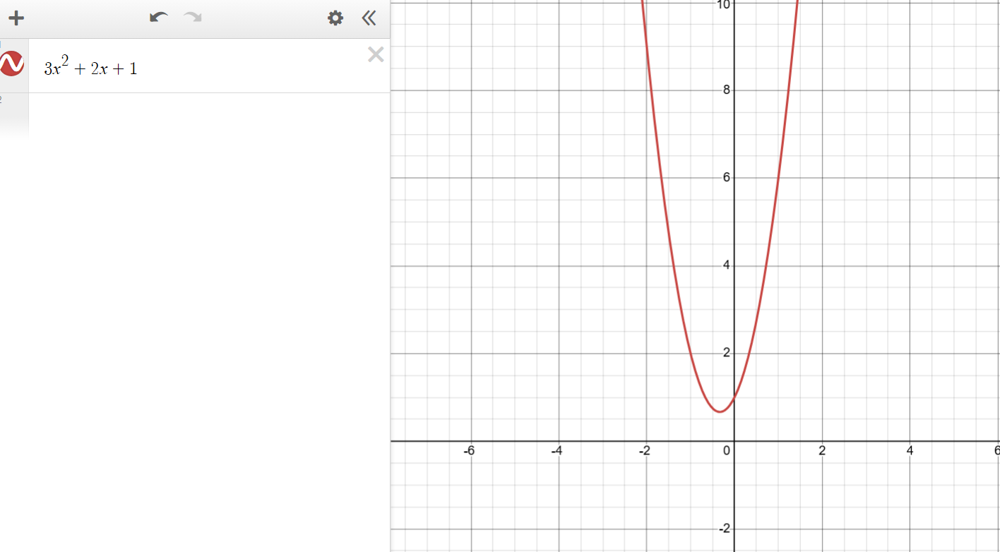
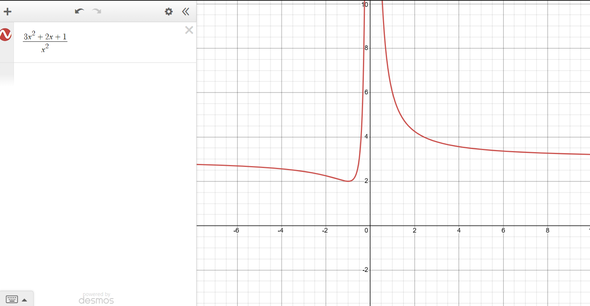
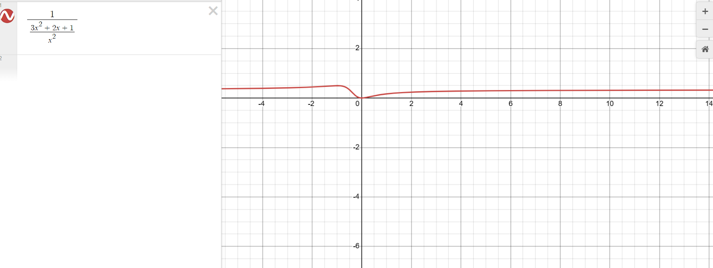

# rational-activation-functions
Experiments on using rational functions as activation functions in neural networks.

## Motivation
I have done research on finding real roots of polynomials. There are several techniques for this, which by single-variable calculus techniques allow us to find local optima of rational functions. If you test each local optimum one-by-one, you can find the global optima by comparing each point.

Polynomial functions have unbounded images. This is problematic as it leads to exploding and vanishing gradients.

## Setup
A specific case of rational functions is an extension of the polynomials, called "Laurent polynomials". These are polynomials that allow terms with integer exponents, including negative ones, rather than restricting them to nonnegative integers.

Rational functions can have horizontal asymptotes that restrict their image. This allows one to limit the possible range of values without having to clip (which leads to annoying discontinuities and whatnot).

For instance, let's take the polynomial
$$P(x):=3x^2+2x+1$$

My first idea was to normalize the degree of the polynomial by dividing by the highest degree term. This would creating Laurent polynomials, which are very simple to differentiate. Something like

$$\deg(P)=2$$
$$\frac{P(x)}{x^2}=\frac{3x^2+2x+1}{x^2}=3+2x^{-1}+x^{-2}$$

However, this results in the same problem of vanishing and exploding gradients as with standard polynomials. 

After observing the behaviour of these Laurent polynomials, I tried taking the reciprocal of this:

$$\frac{1}{\frac{P(x)}{x^2}}=\frac{1}{\frac{3x^2+2x+1}{x^2}}=\frac{x^2}{3x^2+2x+1}$$

As you can see, the function is very well-behaved and the derivative visually looks nice. Unfortunately, these functions are then not as easily differentiable nor composable as standard polynomials or Laurent polynomials, but it is still possible.

This activation function is a rational function, specifically the reciprocal of a Laurent polynomial. This way, if we take the derivative, we only need the power rule, the chain rule and the linearity of derivatives. For instance:

$$\frac{d}{dx}\frac{1}{\frac{3x^2+2x+1}{x^2}}=\frac{d}{dx}\left(3+2x^{-1}+x^{-2} \right)^{-1}=\frac{-2x^{-2}-2x^{-3}}{(3+2x^{-1}+x^{-2})^2}$$

As I write this, I am thinking that using the quotient rule directly is probably simpler. Let's try:

$$\frac{d}{dx}\left(\frac{x^2}{3x^2+2x+1}\right)= \frac{2x(3x^2+2x+1)-x^2(6x+2)}{(3x^2+2x+1)^2}$$

In general, for a polynomial $P(x)$ with degree $n$, we can expect
$$\frac{d}{dx}\left(\frac{x^n}{P(x)}\right)= \frac{nx^{n-1}(P(x))-x^n(\frac{d}{dx}P(x))}{(P(x))^2}=\frac{x^{n-1}(nP(x)-xP'(x))}{(P(x))^2}$$

This can be simplified algebraically if needed, although you can probably evaluate it using Horner's method or something quite quickly. You can re-use the same coefficients, shift by 1 and multiply by the index to compute the derivative. I don't know about numerical instability, but neural networks seem robust to less precision with some techniques.

Now, the original appeal of polynomials was that:
1. Composing them gives another polynomial
2. We know how to actually find global optima of single-variable polynomials

Luckily, rational functions have the same properties, although they involve some more complexity. Let's see how our setup behaves with composition, trying out 3 layers first.

Say we have polynomials $P(x)$ of degree $n$, $Q(x)$ of degree $m$, $R(x)$ of degree $l$. We apply our formula for the activation functions, in that order:
1. $$\frac{x^n}{P(x)}$$
2. $$\frac{x^m}{Q(x)}$$
3. $$\frac{x^l}{R(x)}$$

The result is:

1. $$\frac{x^n}{P(x)}$$
2. $$\frac{(\frac{x^m}{Q(x)})^n}{P\left(\frac{x^m}{Q(x)}\right)}$$
3. $$\frac{\left(\frac{\left(\frac{x^l}{R(x)}\right)^m}{Q\left(\frac{x^l}{R(x)}\right)}\right)^n}{P\left(\frac{\left(\frac{x^l}{R(x)}\right)^m}{Q\left(\frac{x^l}{R(x)}\right)}\right)}$$

So, this formula looks somewhat scary, but the hope is that the degree stays normalized, so it behaves nicely.