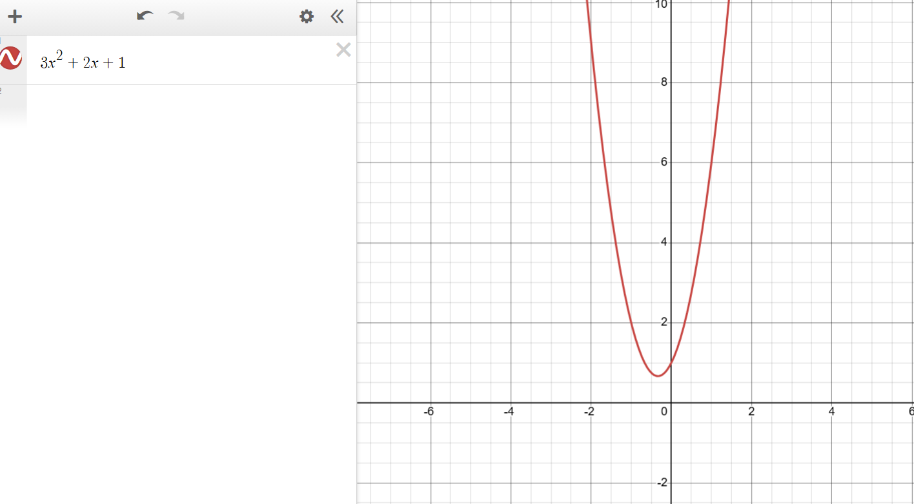
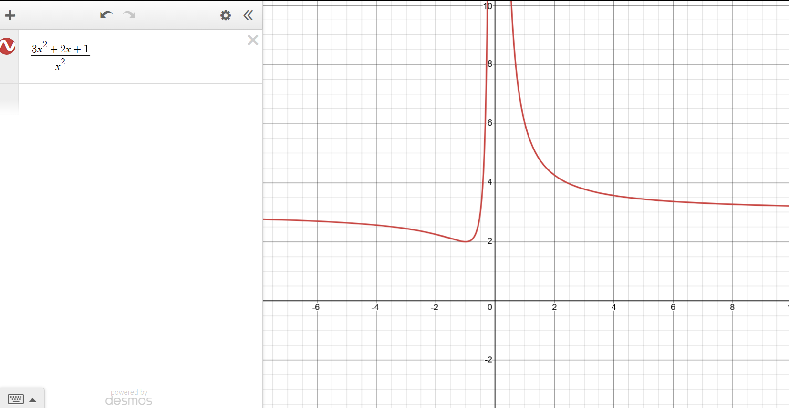
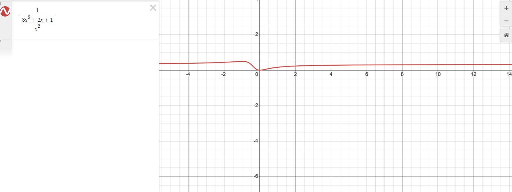
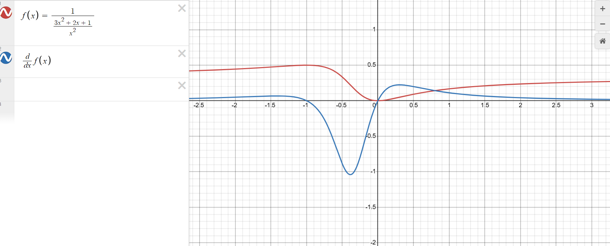
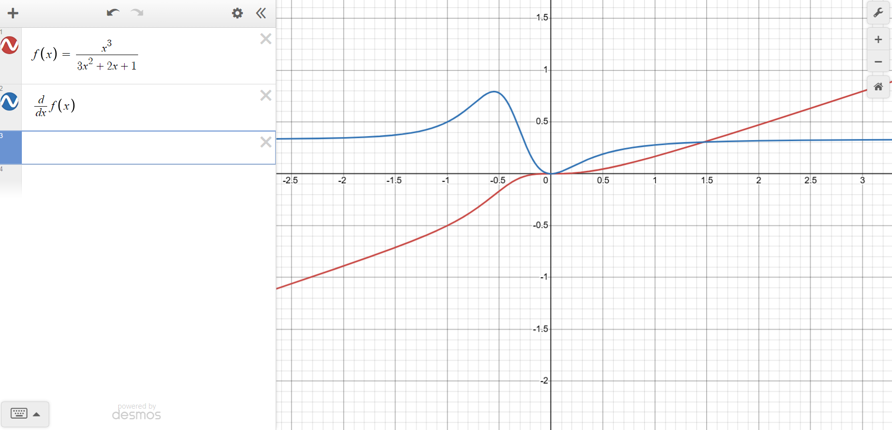

This is a file to work through my thought process. I will leave most things here to see how any ideas get refined.

## Motivation
I have done research on finding real roots of polynomials. There are several techniques for this, which by single-variable calculus techniques allow us to find local optima of rational functions. If you test each local optimum one-by-one, you can find the global optima by comparing each point.

Polynomial functions have unbounded images. This is problematic as it leads to exploding and vanishing gradients.

## "Almost constant" rational functions
A specific case of rational functions is an extension of the polynomials, called "Laurent polynomials". These are polynomials that allow terms with integer exponents, including negative ones, rather than restricting them to nonnegative integers.

Rational functions can have horizontal asymptotes that restrict their image. This allows one to limit the possible range of values without having to clip (which leads to annoying discontinuities in the derivative and whatnot).

There is a problem with rational functions, and it is the fact that they lead to discontinuities at the roots of the denominator, leading to removable discontinuities if you are lucky, but most of the time, poles.

For illustration, let's take the polynomial
$$P(x):=3x^2+2x+1$$

My first idea was to normalize the degree of the polynomial by dividing by the highest degree term. This would creating Laurent polynomials, which are very simple to differentiate. Something like

$$\deg(P)=2$$
$$\frac{P(x)}{x^2}=\frac{3x^2+2x+1}{x^2}=3+2x^{-1}+x^{-2}$$

However, this results in the same problem of vanishing and exploding gradients as with standard polynomials. 

After observing the behaviour of these Laurent polynomials, I tried taking the reciprocal of this:

$$\frac{1}{\frac{P(x)}{x^2}}=\frac{1}{\frac{3x^2+2x+1}{x^2}}=\frac{x^2}{3x^2+2x+1}$$

As you can see, the function is very well-behaved and the derivative visually looks nice. Unfortunately, these functions are then not as easily differentiable nor composable as standard polynomials or Laurent polynomials, but it is still possible.

This activation function is a rational function, specifically the reciprocal of a Laurent polynomial. This way, if we take the derivative, we only need the power rule, the chain rule and the linearity of derivatives. For instance:

$$
\begin{aligned}
\frac{d}{dx}\frac{1}{\frac{3x^2+2x+1}{x^2}}
&=\frac{d}{dx}\left(3+2x^{-1}+x^{-2} \right)^{-1} \\
&=\frac{-2x^{-2}-2x^{-3}}{(3+2x^{-1}+x^{-2})^2} \\
&=\frac{(x^2)^2(-2x^{-2}-2x^{-3})}{(3x^2+2x+x)^2}
\end{aligned}
$$

As I write this, I am thinking that using the quotient rule directly is probably simpler. Let's try:

$$
\begin{aligned}
\frac{d}{dx}\left(\frac{x^2}{3x^2+2x+1}\right)&=\frac{2x(3x^2+2x+1)-x^2(6x+2)}{(3x^2+2x+1)^2}
\end{aligned}
$$
I don't see an obvious pattern like in the previous one, so we'll revert to the previous form. We have that

$$
\frac{d}{dx}\left(\frac{P(x)}{x^n}\right)=\frac{nx^{n-1}P(x)-x^n\frac{d}{dx}P(x)}{x^{2n}}
$$

So the numerator can be written as

$$
nx^{n-1}P(x)-x^n\frac{d}{dx}P(x)=x^{2n}\frac{d}{dx}\left(\frac{P(x)}{x^n}\right)
$$

In general, for a polynomial $P(x)$ with degree $n$, we can expect

$$
\begin{aligned}
\frac{d}{dx}\left(\frac{x^n}{P(x)}\right)&=\frac{nx^{n-1}(P(x))-x^n(\frac{d}{dx}P(x))}{(P(x))^2} \\
&=\frac{x^{2n}\frac{d}{dx}\left(\frac{P(x)}{x^n}\right)}{(P(x))^2}
\end{aligned}
$$

Since $\frac{P(x)}{x^n}$ is a Laurent polynomial, which is very simple to differentiate, then this form is probably easier to work with.

Now, the original appeal of polynomials was that:
1. Composing them gives another polynomial
2. We know how to actually find global optima of single-variable polynomials

Luckily, rational functions have the same properties, although they involve some more complexity. Let's see how our setup behaves with composition, trying out 3 layers first.

Say we have polynomials $P(x)$ of degree $n$, $Q(x)$ of degree $m$, $R(x)$ of degree $l$. We apply our formula for the activation functions, in that order:

1. $$\frac{x^n}{P(x)}$$
2. $$\frac{x^m}{Q(x)}$$
3. $$\frac{x^l}{R(x)}$$

The result is:

1. $$\frac{x^n}{P(x)}$$
2. $$\frac{\left(\frac{x^m}{Q(x)}\right)^n}{P\left(\frac{x^m}{Q(x)}\right)}=\frac{x^{mn}}{Q(x)^nP\left(\frac{x^m}{Q(x)}\right)}$$
3. $$\frac{\left(\frac{\left(\frac{x^l}{R(x)}\right)^m}{Q\left(\frac{x^l}{R(x)}\right)}\right)^n}{P\left(\frac{\left(\frac{x^l}{R(x)}\right)^m}{Q\left(\frac{x^l}{R(x)}\right)}\right)}=\frac{x^{lmn}}{R(x)^{mn}{Q\left(\frac{x^l}{R(x)}\right)^nP\left(\frac{x^{lm}}{R(x)^mQ\left(\frac{x^l}{R(x)}\right)}\right)}}$$

So, this formula looks somewhat scary, but the hope is that the degree stays normalized, so it behaves nicely. We see that each iteration can be simplified to put a power of $x$ in the numerator and a product of polynomials functions applied to rational functions in the denominator.

## "Almost affine" rational function
Apparently, functions with horizontal asymptotes can be troublesome due to their vanishing gradients in very large terms. So instead of "almost constant" rational functions as described in the previous section, let's try upping the degree by one to create "almost affine" rational functions (in the sense that they approach affine functions in asymptotes).

For instance, taking $$P(x):=3x^2+2x+1$$ again, maybe it would be better to try

$$\deg(P)+1=3$$
$$f(x):=\frac{x^{\deg P+1}}{P(x)}=\frac{x^3}{3x^2+2x+1}$$

This is maybe more interesting, since the derivative now approaches a constant function, following the original "almost affine" rational activation function. It would mitigate issues with vanishing gradients while having expressivity in some places.
